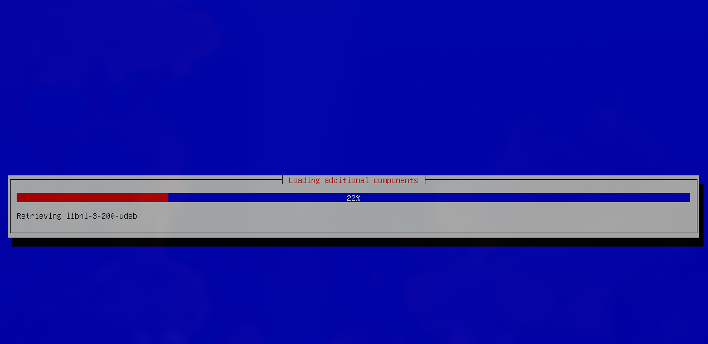

# Лабораторная работа номер 2
## Студент: Кроитор Александр
## Группа: IA2403
## Преподователь: M. Croitor

### Предисловие:

Меня зовут Кроитор Александр, Linux является моей основной и единственной операционной системой, поэтому, так как я обладаю некоторыми преимущества на этом фоне, обозначу используемые помимо всего прочего инструменты:

- neovim (вместо обработки данных через nano, мою полную конфигурацию составленную лично мной можете найти на codeberg yorunikakeru/dotfiles/nvim)
- nixos как гостевая ос из которой я буду создвать VM 

Дебиан является легендарной операционной системой, так как является первым популярным дистрибутивом, но он мне не нравится, так как в погоне за стабильностью версии курирующих пакетов отстауют на несколько MAJOR версий.

### Шаги:

Скачиваем образ Debian (минимальный образ с основного сайта)
```bash
wget https://ftp.psn.ru/debian-cd/current/amd64/iso-cd/debian-13.3.0-amd64-netinst.iso ./dvd

```

qemu у меня уже был, но покажу как он скачивается на nixos

```nix
  environment.systemPackages = with pkgs; [
    # System utilities
      qemu_full
  ]
```
```bash
    sudo nixos-rebuild switch
```
Создание образа диска на 8G по заданию выглядит так
```bash
qemu-img create -f qcow2 debian.qcow2 8G
```


Мне хочется лучше показать диапазон возможнстей qemu как инструмента, поэтому опишу явно как это можно сделать
```bash
qemu-system-x86_64 \
        -enable-kvm \
        -m 8192 \
        -cpu host \
        -smp 4 \
        -cdrom  ./dvd/debian-13.3.0-amd64-netinst.iso \
        -drive file=debian.qcow2, if=virtio  \
        -net nic -net user
```
Опишем поэтапно суть этой комманды, флаги, заполненные мною. (за основу запроса стоит создание реальной виртуальной машины на системе Oracle, поменялся лишь cdrom)
- qemu-system-x86_64 - Запускает эмулятор QEMU для 64-битных x86 систем (Intel/AMD).
- -enable-kvm включает использование KVM (Kernel-based Virtual Machine), позволяет VM использовать аппаратное ускорение процессора, blazing
- -m задача памяти, 8192  мб, т.е. 8гб
- -cpu host виртуальная машина будет использовать тот же тип CPU что и хост, улучшает производительность
- smp, количество виртуальных процессорных ядер, 4 ядра
- -cdrom подключает ISO-образ как CD-ROM 
- -drive file=debian.qcow2,if=virtio Задаёт виртуальный жёсткий диск
- -net nic -net user, настройка сети, -net nic = виртуальная сетевая карта NIC , -net user подключение через user-mode networking, т.е. NAT через хост (По-русски, VM выходит в сеть, сеть не входит в VM)
     
Загрузка аля мы не в 90-х

