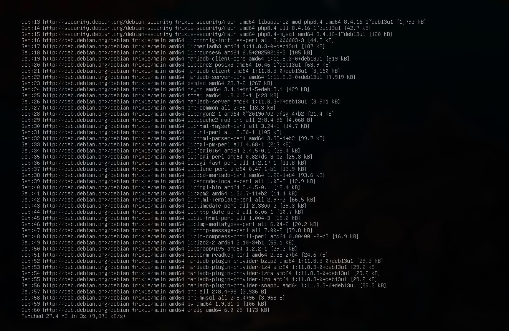
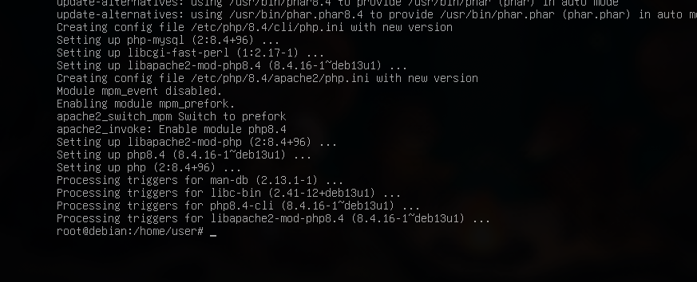
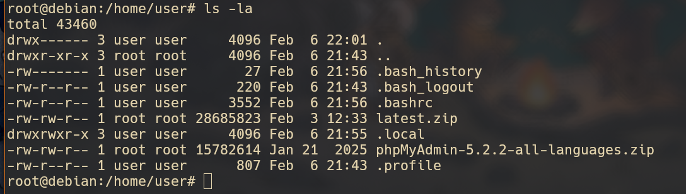
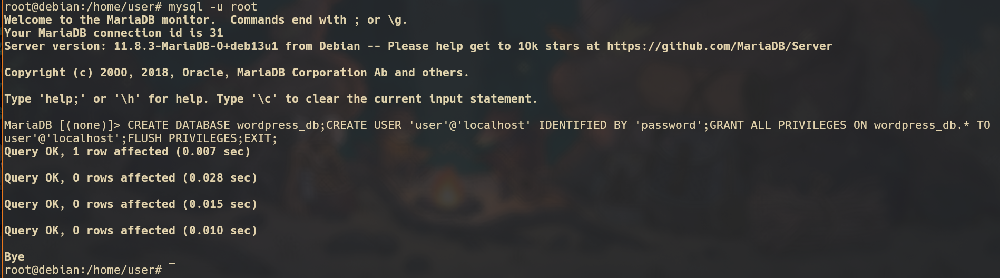
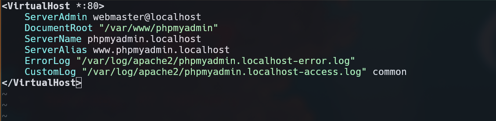
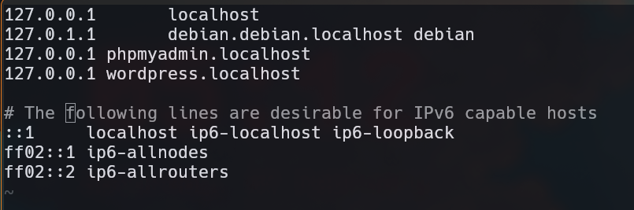
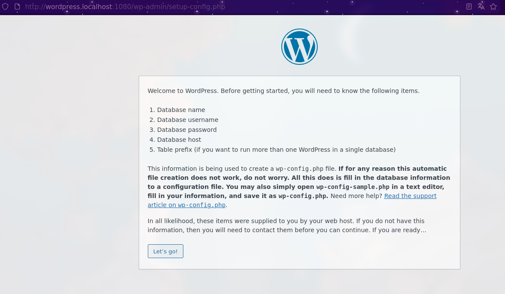
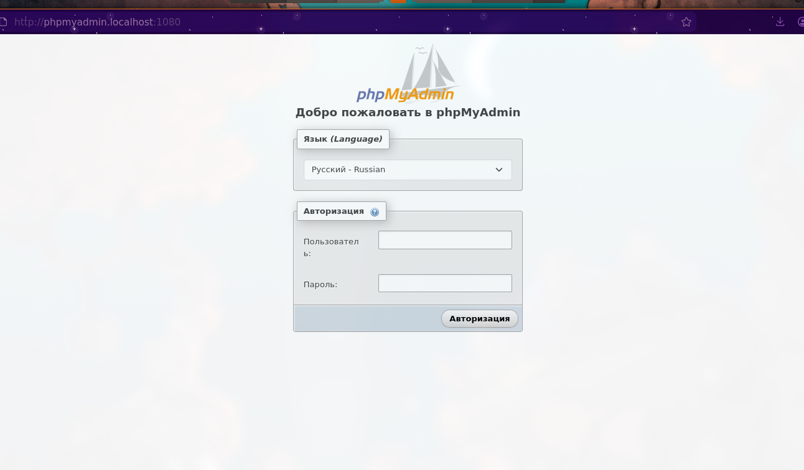
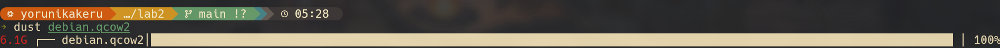

# Лабораторная работа номер 2
## Студент: Кроитор Александр
## Группа: IA2403
## Преподователь: M. Croitor
## Дата: 02-07-2026
### Предисловие:

Меня зовут Кроитор Александр, Linux является моей основной и единственной операционной системой, поэтому, так как я обладаю некоторыми преимущества на этом фоне, обозначу используемые помимо всего прочего инструменты:

- neovim (вместо обработки данных через nano, мою полную конфигурацию составленную лично мной можете найти на codeberg yorunikakeru/dotfiles/nvim)
- nixos как гостевая ос из которой я буду создвать VM 

Дебиан является легендарной операционной системой, так как является первым популярным дистрибутивом, но он мне не нравится, так как в погоне за стабильностью версии курирующих пакетов отстауют на несколько MAJOR версий.

#### Шаги:

Скачиваем образ Debian (минимальный образ с основного сайта)
```bash
wget https://ftp.psn.ru/debian-cd/current/amd64/iso-cd/debian-13.3.0-amd64-netinst.iso ./dvd

```

qemu у меня уже был, но покажу как он скачивается на nixos

```nix
  environment.systemPackages = with pkgs; [
    # System utilities
      qemu_full
  ]
```
```bash
    sudo nixos-rebuild switch
```
Создание образа диска на 8G по заданию выглядит так
```bash
qemu-img create -f qcow2 debian.qcow2 8G
```


Мне хочется лучше показать диапазон возможнстей qemu как инструмента, поэтому опишу явно как это можно сделать
```bash
qemu-system-x86_64 \
        -enable-kvm \
        -m 8192 \
        -cpu host \
        -smp 4 \
        -cdrom  ./dvd/debian-13.3.0-amd64-netinst.iso \
        -drive file=debian.qcow2, if=virtio  \
        -net nic -net user
```
Опишем поэтапно суть этой комманды, флаги, заполненные мною. (за основу запроса стоит создание реальной виртуальной машины на системе Oracle, поменялся лишь cdrom)
- qemu-system-x86_64 - Запускает эмулятор QEMU для 64-битных x86 систем (Intel/AMD).
- -enable-kvm включает использование KVM (Kernel-based Virtual Machine), позволяет VM использовать аппаратное ускорение процессора, blazing
- -m задача памяти, 8192  мб, т.е. 8гб
- -cpu host виртуальная машина будет использовать тот же тип CPU что и хост, улучшает производительность
- smp, количество виртуальных процессорных ядер, 4 ядра
- -cdrom подключает ISO-образ как CD-ROM 
- -drive file=debian.qcow2,if=virtio Задаёт виртуальный жёсткий диск
- -net nic -net user, настройка сети, -net nic = виртуальная сетевая карта NIC , -net user подключение через user-mode networking, т.е. NAT через хост (По-русски, VM выходит в сеть, сеть не входит в VM)
     
Загрузка аля мы не в 90-х


Дебиан ставится удивительно долго.

Поэтому, чтобы не терять время зря, опишу что значит каждый установленный пакет, с которым мы работаем
Для начала, apt
- apt - коммандный инснтруем на дистрибутивах семейства дебиан и убунту (убунту сейчас имеет два пакетных менеджера), управляет пакетами из основного репозитория пакетов (аналоги: Pacman (AUR), zypper, nix, brew на macos, pkg на bsd)
- apache2 - вебсервер, один из самых популярных в мире, разработан очень давно, но благодаря модульной архитектуре сохраняет и обновляется, работает для посредник между браузером и сайтом. Конфигурируется в apache2.conf в /etc/ папке, папка /etc/ хранит центральную конфигурацию операционной системы
- php - самый популярный веб язык, был прорывным в своё время, здесь используется скорее всего как зависимость, следующие утилиты так или иначе связаны с php
- libapache2-mod-php - модуль для Apache2, позволяет серверу обрабатывать php код прямо в вебстраницах, используется wordpress, сейчас очень устаревшая система сама по себе и считается legacy
- php-mysql - модуль php, отвечающий за возможность php работать с базами данных Mysql и MariaDB по умолчанию
- mariadb-server - форк mysql, полностью совместим с mysql
- mariadb-client - клиентская часть mariadb-server, позволяет подключаться к MariaDB, MySQL, позволяет выполнять запросы SQL, управлять базами и пользователями
- unzip - деархиватор

Я написал это всё вручную, пока ставился debian, а он всё ещё грузится

[ссылка на issue](https://unix.stackexchange.com/questions/570946/debian-why-is-the-base-system-installation-taking-so-long)
оказывается дебиан скачивает систему step by step устанавливая пакеты
Спустя ещё ~~три~~ все тесты по курсу
Debian ещё запускается
Запустился!!

reboot через комманду
```bash
qemu-system-x86_64 -hda debian.qcow2 -m 8G -smp 2 -device e1000,netdev=net0 -netdev user,id=net0,hostfwd=tcp::1080-:80,hostfwd=tcp::2222-:22
```

логинемся в **super** пользователя и устанавливаем всё необходимое
```bash
su
apt update -y
apt install -y apache2 php libapache2-mod-php php-mysql mariadb-server mariadb-client unzip
```



Скачиваем систему управления базой данных phpMyAdmin
```bash
wget https://files.phpmyadmin.net/phpMyAdmin/5.2.2/phpMyAdmin-5.2.2-all-languages.zip
```
и CMS Wordpress
```bash
wget https://wordpress.org/latest.zip
```


Далее для более приятного ux я воспользовался ssh клиентом (предварительно открыв порт 2222) для подключения к виртуальной машине, поэтому фон и картинка будет отличаться, не удивляйтесь (мне просто лень вводить большие комманды вручную)


разархивируем файлы
```bash
unzip latest.zip -d /var/www/
unzip phpMyAdmin-5.2.2-all-languages.zip -d /var/www/
```

Создаём базу данных wordpress_db


Создаём конфигурационный файл для myadmin
```bash
nvim /etc/apache2/sites-available/01-phpmyadmin.conf
```


и тоже самое с wordpress
```bash
nvim /etc/apache2/sites-available/02-wordpress.conf
```


Запускаем наши сервисы
```bash
root@debian:/home/user# /usr/sbin/a2ensite 01-phpmyadmin
Enabling site 01-phpmyadmin.
To activate the new configuration, you need to run:
  systemctl reload apache2
root@debian:/home/user# systemctl reload apache2
root@debian:/home/user# /usr/sbin/a2ensite 01-phpmyadmin
Site 01-phpmyadmin already enabled
```

```bash
root@debian:/home/user# /usr/sbin/a2ensite 02-wordpress
Enabling site 02-wordpress.
To activate the new configuration, you need to run:
  systemctl reload apache2
root@debian:/home/user# systemctl reload apache2 # перезагрузка apache2 сервера
root@debian:/home/user# /usr/sbin/a2ensite 02-wordpress
Site 02-wordpress already enabled
root@debian:/home/user#
```
в /etc/hosts добавляем новые адреса
```bash
nvim /etc/hosts
```
Добавили


```bash
root@debian:/home/user# uname -a
Linux debian 6.12.63+deb13-amd64 #1 SMP PREEMPT_DYNAMIC Debian 6.12.63-1 (2025-12-30) x86_64 GNU/Linux
```

wordpress успешно запустился

myadmin тоже



### Ответы на доп.вопросы
1. Каким образом можно скачать файл в консоли при помощи утилиты wget?
wget <url> path/to/
- Oбычно это архив, после его необходимо разархивировать уже в зависимости от формата
2. Зачем необходимо создавать для каждого сайта свою базу и своего пользователя? 
- Безопасность, при взломе одного сайта, злоумышленник не получит доступ к другим данных с других сайтов, изоляция данных, каждая база данных изолирована друг от друга, users в одной бд могут иметь свои уникальные поля со своей бизнес логикой, а другой сервис - с своей. И управление ресурсами, ограничение пользователя на количество соеденений, квотам, привелегиям и тд.
3. Как поменять доступ к системе управления БД на порт 1234? 
- Порт определяется в строке <VirtualHost *:80>, 80 здесь то порт на котором Apache слушает HTTP-запросы, поменяв его 1234, порт слушания будет соотвественно 1234
4. Какие преимущества, с вашей точки зрения, даёт виртуализация?
- Изоляция на уровне системы, а не ОС позволяет безопасно хранить пользовательскую информацию, гарантирует практически safety других сервисов при краше виртуальной машины, лёгкое нативное ограничение ресурсов. Лёгкое клонирование, переносимость и откатываемость 
5. Для чего необходимо устанавливать время / временную зону на сервере?
- Для корректного логирование, так как ве сервисы используют одно време это облегчает дебаг и аудит ошибок. Так же синхронизация с пользователями, для веб сервисов очень важно, чтобы метки времени совпадали с ожидаемыми пользователями. Плюс сертификаты и токены зависимы от конкретнго времени. 
6. Сколько места занимает установленная вами ОС (виртуальный диск) на хостовой машине?

6 гигобайт
7. Какие есть рекомендации по разбиению диска для серверов? Почему рекомендуется так разбивать диск?
/ - root системные файлы, ядро
/boot - boot, загрузочные файлы, ядро
/home - пользовательские файлы
/var - логи, кэш, базы данных
/tmp - временные файлы
/swap - подкачка swap памяти
/opt - дополнительные приложения
распределение таким образом в первую очередь защищает root директории от переполнения, переполненнные /var и /tmp не мешают серверу работать, разные разделы можно монтировать разными файловыми системами, а так же просто мигрировать.
